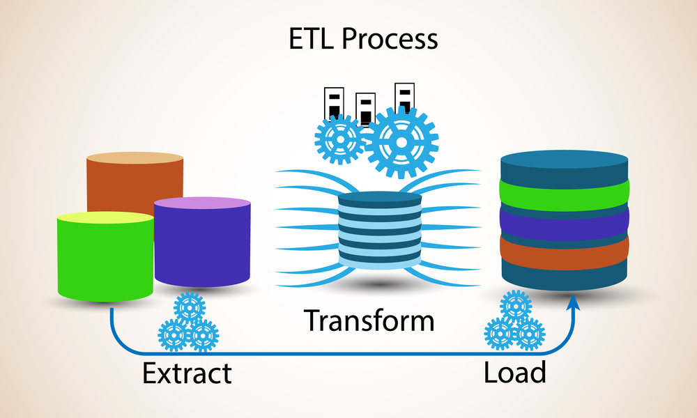

# Introduction

Krawler aims at making the automated process of extracting and processing (geographic) data from heterogeneous sources easy. It can be viewed as a minimalist **Extract, Transform, Load** (ETL). [**ETL**](https://en.wikipedia.org/wiki/Extract,_transform,_load) refers to a process where data is
1. **extracted** from heterogeneous data sources (e.g. databases or web services);
2. **transformed** in a target format or structure for the purposes of querying and analysis (e.g. JSON or CSV);
3. **loaded** into a final target data store (e.g. a file system or a database).

ETL naturally leads to the concept of a **pipeline**: a set of processing functions (called **hooks** in krawler) connected in series, often executed in parallel, where the output of one function is the input of the next one. The execution of a given pipeline on an input dataset to produce the associated output is a **job** performed by krawler.

A set of introduction articles to krawler have been written and detail:
* [the underlying concepts](https://medium.com/@luc.claustres/a-minimalist-etl-using-feathersjs-part-1-1d56972d6500)
* [the practical use case of geographical data processing](https://medium.com/@luc.claustres/a-minimalist-etl-using-feathersjs-part-2-6aa89bd73d66)
