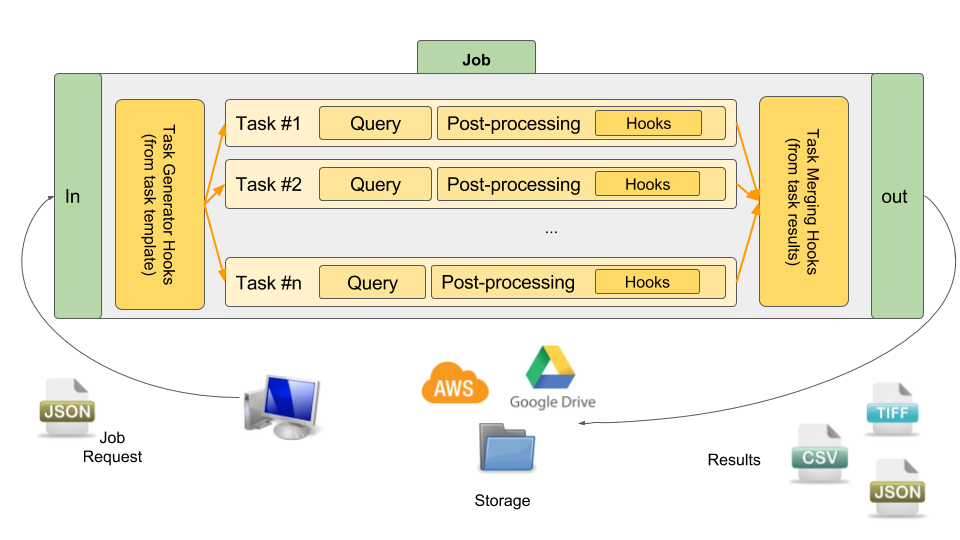

# How does it work ?

**krawler** is powered by [Feathers](https://feathersjs.com/) and rely on two of its main abstractions: [services](https://docs.feathersjs.com/api/services.html) and [hooks](https://docs.feathersjs.com/api/hooks.html). 
We assume you are familiar with this technology.

## Main concepts

**krawler** manipulates three kind of entities:
* a **store** define where the extracted/processed data will reside,
* a **task** define what data to be extracted and how to query it,
* a **job** define what tasks to be run to fulfill a request (i.e. sequencing).

On top of this [hooks](https://docs.feathersjs.com/api/hooks.html) provide a set of functions that can be typically run before/after a task/job such as a conversion after a download or task generation before a job run. More or less, this allows to create a [processing pipeline](https://en.wikipedia.org/wiki/Pipeline_(computing)).

Regarding the store management we rely on [abstract-blob-store](https://github.com/maxogden/abstract-blob-store), which abstracts a lot of different storage backends (local file system, AWS S3, Google Drive, etc.), and is already used by [feathers-blob](https://github.com/feathersjs-ecosystem/feathers-blob).

## Global overview

The following figure depicts the global architecture and all concepts at play:

## What is inside ?

**krawler** is possible and mainly powered by the following stack:
* [Feathers](https://feathersjs.com/)
* [Lodash](https://lodash.com/) A JavaScript utility library
* [node-gdal](https://github.com/naturalatlas/node-gdal) the Node.js binding of [GDAL / OGR](http://www.gdal.org/) used to process rasters and vectors
* [js-yaml](https://github.com/nodeca/js-yaml) used to process YAML files
* [xml2js](https://github.com/Leonidas-from-XIV/node-xml2js) used to process XML files
* [json2csv](https://github.com/zemirco/json2csv) used to process CSV files
* [fast-csv](https://github.com/C2FO/fast-csv) used to stream CSV files
* [abstract-blob-store](https://github.com/maxogden/abstract-blob-store) used to abstract storage
* [request](https://github.com/request/request) used to manage HTTP requests
* [node-postgres](https://github.com/brianc/node-postgres) used to manage PostgreSQL database
* [node-mongodb](http://mongodb.github.io/node-mongodb-native/) used to manage MongoDB database
